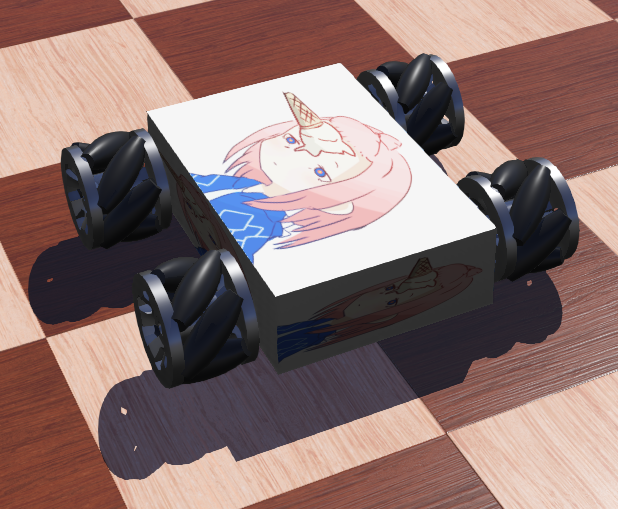

# Webots 搭建麦轮小车

| 学号：19335109 | 姓名：李雪堃 |
| -------------- | ------------ |

## 一、实验目标

使用 webots 仿真软件，搭建一辆麦克纳姆轮小车；熟悉 webots 环境。

## 二、实验内容与步骤

### (1) 修改世界坐标系

首先创建一个 my_car 目录，再在 my_car 目录下创建 world 子目录，用于存放 .wbt 文件。

然后，在 webots 左上角点击 File - New World，创建新世界。修改世界的坐标系统为 ENU，即 Z 轴向上的右手坐标系，保存后重启 webots。


### (2) 设置光源和地面

在仿真界面右键，选择 Add New，选择 PROTO nodes - backgrounds 下的背景和光源添加。


然后点击上方菜单栏的 View，选择 Change View - Back View，调整视角，这时就可以看到背景了。

接着，用同样的方法，选择 PROTO nodes - floors 下的 CircleArena，添加一个圆形地面。我们设置半径长度 radius 为 3，并在 rotation 中让地面转一下向，设置围墙的厚度为 0.05、高度为 0.5。


### (3) 设置车体、电机和麦轮

接下来，先创建 Robot 节点，然后在 children 属性下添加一个 Shape 节点，改名为 Body，作为小车的车体。设置车体的几何属性，设置 geometry 为 Box 节点，长宽高分别为 0.3、0.2、0.08，车体就是一个长方体盒子。再设置车体的外观和材质，用一张贴图让小车变得好看些。


还要设置它的物理碰撞边界，同时设置物理属性，否则小车不受重力的影响。


麦轮的制作比较复杂，我们直接将 kuka 公司的 youbot 机器人的麦轮复制过来使用。点击 File - Open Sample World，选择 kuka - youbot，进入世界后，发现 youbot 节点是一体的，里面封装了很多 base node，右击 Youbot 节点，选择 Convert to Base Node，就可以将 Youbot 解包成 Robot 基本节点，在里面就可以看到麦轮的节点。分别将这 4 个麦轮复制过来，就能对它们进行设置和使用。


解包前的 Youbot：


解包后的 Youbot：


然后，我们按照下面的坐标关系设置麦轮中电机的 axis 和 anchor，四个电机的 axis 都设置为 0 1 0，锚点 anchor 设置为下图中的值，因为小车的长宽分别是 0.3 和 0.2，小车坐标为 0 0 0，所以下面的数值很好理解。


比如，麦轮 1 的设置，其余 3 个麦轮设置与其类似。注意到要将电机改名为 motor1，后面的 controller 程序要用到这个命名来找到和初始化电机，然后才能在程序中控制电机。


设置好后，我们的小车看起来像下面这样。



### (4) 编写控制器

首先，选择控制器的名称为 my_controller。webots 会为我们创建 my_controller.cpp 文件，用于控制小车。


控制器 `my_controller.cpp` 代码：

```C++
#include <webots/Robot.hpp>
#include <webots/Motor.hpp>
#include <webots/Keyboard.hpp>
#include <iostream>
#include <limits>

#define MAX_SPEED 20

using namespace std;
using namespace webots;

void set_speed(double *speed, int key_value, double velocity)
{
  if (key_value == 'W') // forward
  {
    speed[0] = velocity;
    speed[1] = velocity;
    speed[2] = velocity;
    speed[3] = velocity;
  }
  else if (key_value == 'S')  // backward
  {
    speed[0] = -velocity;
    speed[1] = -velocity;
    speed[2] = -velocity;
    speed[3] = -velocity;
  }
  else if (key_value == 'A')  // leftward
  {
    speed[0] = velocity;
    speed[1] = -velocity;
    speed[2] = velocity;
    speed[3] = -velocity;
  }
  else if (key_value == 'D')  // rightward
  {
    speed[0] = -velocity;
    speed[1] = velocity;
    speed[2] = -velocity;
    speed[3] = velocity;
  }
  else if (key_value == 'Q')  // leftcircle
  {
    speed[0] = velocity;
    speed[1] = -velocity;
    speed[2] = -velocity;
    speed[3] = velocity;
  }
  else if (key_value == 'E')  // rightcircle
  {
    speed[0] = -velocity;
    speed[1] = velocity;
    speed[2] = velocity;
    speed[3] = -velocity;
  }
}

int main(int argc, char **argv) {
  Robot *robot = new Robot();	// create robot

  Motor *motors[4];
  char wheels_names[4][8] = {"motor1", "motor2", "motor3", "motor4"};

  for (int i = 0; i < 4; i++) // get motors and initialize
  {
    motors[i] = robot->getMotor(wheels_names[i]);
    motors[i]->setPosition(std::numeric_limits<double>::infinity());
    motors[i]->setVelocity(0.0);
  }

  Keyboard keyboard;
  keyboard.enable(1); // set keyboard read frequency
  double time_step = robot->getBasicTimeStep(); // set virtual time step in simulation
  double velocity = 0.5 * MAX_SPEED;  // set velocity
  while (robot->step(time_step) != -1) {
    int key_value1 = keyboard.getKey();
		int key_value2 = keyboard.getKey();

    double speed1[4] = {0};
    double speed2[4] = {0};
   
    set_speed(speed1, key_value1, velocity);
    set_speed(speed2, key_value2, velocity);

    for (int i = 0; i < 4; i++)
		{
			motors[i]->setVelocity(speed1[i] + speed2[i]);
		}
  };

  delete robot;
  return 0;
}
```

main 函数中，首先创建一个 Robot 对象，对应我们的 Robot 节点。然后创建 4 个 Motor 对象，并对它们进行初始化，需要用到电机的名字来识别，这与我们之前在麦轮中设置的名字相对应。

然后创建 Keyboard 对象，用于读取键盘输入，设置键盘读取间隔时间为 1ms。然后获取仿真环境中的 time step，这确定了模拟仿真时物理运动重新计算和刷新的频率。

在物理模拟的每一帧中，从键盘读入两个输入，这样可以同时按下两个键，实现小车的斜向运动，然后调用 set_speed 函数根据键盘输入来设置 speed1 和 speed2。set_speed 函数根据输入的 W、A、S、D、Q、E 分别设置 4 个电机的速度。最后， 4 个电机的速度由 speed1 和 speed2 叠加而成。

### (5) 摩擦设置

上面做完之后，仿真时发现小车运动时像在漂移，很难控制，需要设置世界的接触性质。在 WorldInfo - contactProperties 中添加两个 ContactProperties 节点，参数设置如下。

这些参数实际上在 kuka 的 youbot 里面也可以找到。


## 三、实验结果与分析

最后的 Robot 节点树如下。小车可成功前后左右、斜向运动以及自旋。


## 四、实验中的问题与方法

- 问题：小车和地面打滑

  解决办法：按照 youbot 里面 WorldInfo 的设置，修改 ContactPorperties 的参数；增加小车的重量到 50，有一定改善

- 问题：控制器中的 Time Step，起初我定义一个 TIME_STEP 宏，数值是 32，发现在仿真时小车运动状态的更新很慢，延迟高

  解决办法：使用 robot 类里面提供的 getBascTimeStep 方法，仿真时物理运动更新很快

- 问题：键盘的输入

  解决办法：一开始我没注意处理 speed1 和 speed2 没有在下一帧开始前重置为 0 的问题，导致按一个小车运动的叠加，后来把 speed1 和 speed2 声明在物理运动的每一帧里面，初始化为 0，问题就解决了