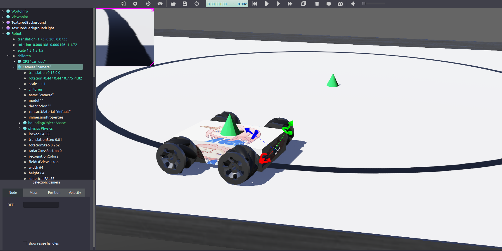
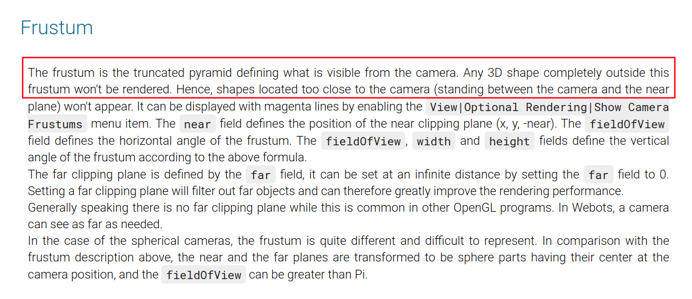
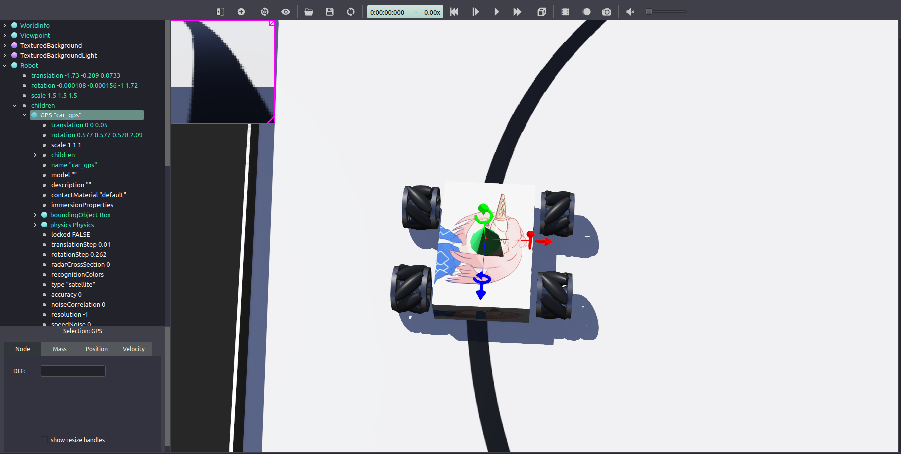
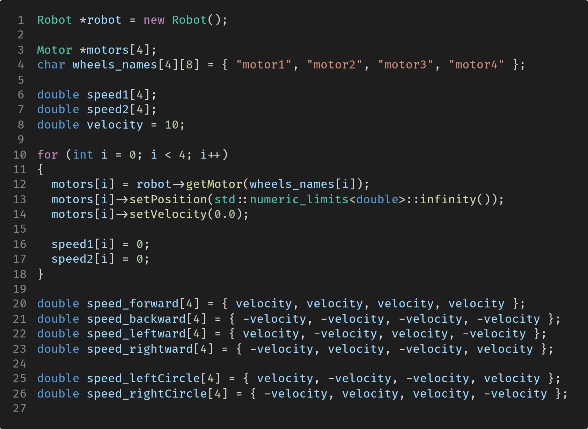
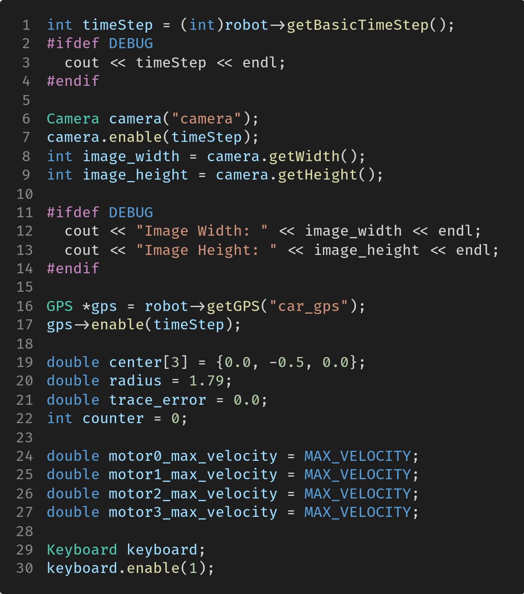
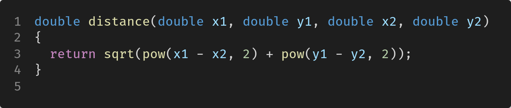
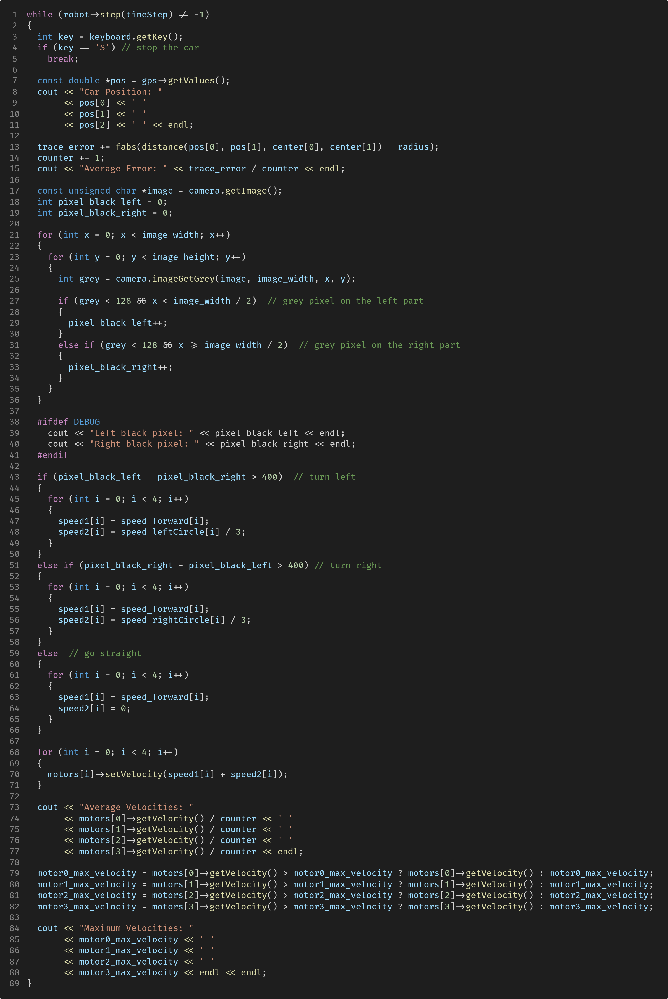
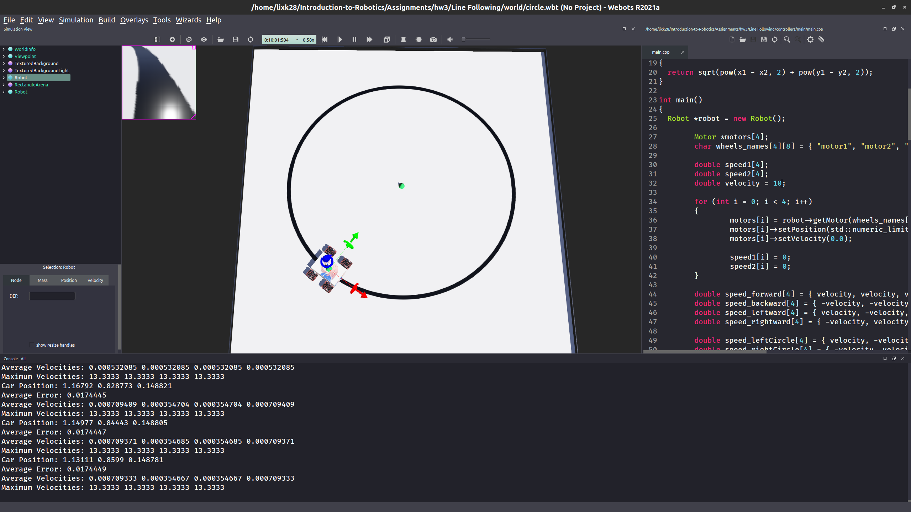

# HW3: 视觉巡线小车

|                                |                     |
| :----------------------------- | :------------------ |
| 学号：19335109                 | 课程：机器人导论    |
| 姓名：李雪堃                   | 学期：Fall 2021     |
| 专业：计算机科学与技术（超算） | 教师：成慧          |
| 邮箱：i@xkun.me                | TAs：黄家熙、李皖越 |

---

***Table of Contents***

[toc]

---

## (一) 实验要求

- 让小车沿着规定的轨道（通常是黑线）按照一定的速度进行移动。在本次实验中，需要为小车
  添加相机，根据图像信息，设计算法使小车能沿着地面的黑线行驶。
- 小车巡线一周的时间。精确计算可能有困难，粗略估计就好。
- 速度指代码中电机设置的速度，即 `motors[i]->setVelocity(X)` 中的X。包括平均速度和最大速度。
- 计算公式 $\displaystyle\frac{1}{n}\sum_{i=1}^n(p_i - r)$
  ， $p_i$ 为小车到圆心的距离，$r$ 为圆的半径。

## (二) 实验环境

- Ubuntu 20.04.3 LTS x86_64
- Webots R2021a

## (三) 实验过程和核心代码

首先，在我们小车车头的中间位置添加一个 camera 节点。命名为 camera，设置 camera 节点的物理属性 physics 和碰撞属性 boudingObject，然后在 camera 节点的子节点下创建一个 Shape 节点，设置为 Box，这样 camera 就有了可以看见的几何形状。

接下来是关键的一步，要将 camera 的摄像头调整到正确的位置，这需要我们旋转 camera。根据 Webots 官方文档的描述，camera 的摄像头是透视投影，视野范围是一个圆锥形的视野。如果我们编写 camera 的代码并开启 camera 的 image 窗口，仿真时就可以在左上角看到图像，能正确读取前下方的图像就说明我们成功了。

接下来，我们在小车的中央安装一个 GPS，用于获取小车的 XYZ 坐标。

在 robot 节点的子节点下创建一个 GPS 节点，命名为 car_gps，这在代码中要用来初始化 GPS。然后设置物理碰撞属性、几何形状，以及它的坐标使之放在小车的上面。

接下来，就可以编写控制器的代码了。

首先，我们创建 robot 和 motors，分别表示我们的小车和电机。然后初始化电机的速度，还有我们用于更新速度的 6 个方向的速度组。

然后，第 1 ～ 3 行，获取物理仿真的 timeStep。

第 6 ～ 14 行，根据 timeStep 来初始化 camera，并获取摄像机拍摄照片的宽和高，这在我们后面的巡线算法中要用到。DEBUG 是我定义的一个宏，用于输出一些 DEBUG 信息，代码中已经注释掉。

第 16 ～ 27 行，根据 timeStep 初始化 gps，`center` 给出了圆心的坐标 (0.0, -0.5, 0.0)，`radius` 是圆的半径 1.79，这是我们仔细测量得到的，我没有用 3 个 GPS 的做法，只在小车上安装了 GPS，因为 GPS 还要设置它具体的坐标，设置好了还要在代码中获取，不如自己先在仿真中测量好。`trace_error` 是用于记录巡线误差，`counter` 每过仿真时间片一次便递增 1.

第 29 ～ 30 行，初始化键盘。

接下来是重头戏，进入小车主控制循环。

首先，在 3 ～ 4 行，读取键盘输入，来停止小车。

第 7 ～ 15 行，`pos` 获取小车上 GPS 的位置，即我们小车的位置，并输出到终端。然后，计算小车到圆心距离与半径之差的绝对值，distance 是一个函数，用于计算 (x1, y1) 和 (x2, y2) 两点之间的距离。我们只需要平面距离，不需要 Z 坐标。==注意到必须要加绝对值，否则误差可能会前后抵消==。接着 `counter` 递增，输出每次仿真的平均误差。

第 17 ～ 19 行，首先调用 `camera.getImage()` 获取图像，然后定义两个变量，`pixel_black_left` 和 `pixel_black_right`，分别用于记录图片的左半部分和右半部分的黑色像素的值（偏黑的像素）。

第 21 ～ 36 行，遍历图像的宽和高，利用 `camera` 的 `imageGetGrey` 方法获取每个像素的灰度值，Webots 计算灰度值的方法是简单的将像素的 RGB 三个通道的分量相加然后除以 3。接着，判断该像素是否是黑色像素（==我们认为灰度值小于 128 则为黑，认定为地面上的黑线==，因为 Grey 的取值是 0 到 256，所以这样是比较合理的），并判断该像素在图像的左半部分还是右半部分，并将对应的 `pixel_black_left` 和 `pixel_black_right` 递增。
$$
Grey = \frac{R + G + B}{3} \\
R, G, B \in [0, 256], Grey \in [0, 256]
$$
遍历完整个图像后，我们就获得了图像左半部分的偏黑像素个数 `pixel_black_left` 和右半部分的偏黑像素个数 `pixel_black_right`。

第 43 ～ 71 行，根据 `pixel_black_left` 和 `pixel_black_right` 的值来决定小车是左转还是右转。这时我们要设计一个比较合理的方法，直接判断大小肯定不行，这样小车很容易在转向时转动幅度过大或乱转。一个合理的方法是设置一个阈值 `S`，如果 `pixel_black_left - pixel_black_right` 大于这个阈值 `S` 就可以认为左半部分比右半部分的黑色像素多足够多的数量，小车应该左转，右转同理。那么这个阈值多少比较合适呢？我的一个直观的感觉是图像的 1 / 9 比较合适，图像的 size 是 64x64 的，所以取 400 比较好。另外，还应该注意到我们转向的速度设置为 1 / 3 了，为了防止小车转的过快。

第 73 ～ 88 行，输出 4 个电机的平均速度和最大速度。

## (四) 实验结果

小车跑一圈（圆圈路线）的视频在 demo_circle.mp4。小车跑椭圆路线的视频在 demo_ellipse.mp4。

为了测试算法的稳定性，仿真进行 10 分钟，可以看到小车仍然在正常巡线，说明我们的算法和设置的参数还是比较稳定的。

另外，在上面输出的信息还可以看到，小车 4 个电机的平均速度大约为：

- 0.0007，0.00035，0.00035，0.0007

实际上这是不合理的平均速度计算导致的。助教给出的方法是每次获取速度并除以总的次数，这样会越来越小。我觉得用一周的长度除以时间比较合理，这也反映了小车实际的运行速度。

小车 4 个电机的最大速度分别为：

- 13.33， 13.33，13.33，13.33

观看 demo.mp4 小车运行一圈大约需要花 14 ～ 15 秒。

如果一直观察会发现，小车巡线误差维持的非常稳定，从开始 0.4 迅速下降到 0.18，然后一直保持在 0.0175 左右，也就是 1.75cm，误差比较小。

## (五) 实验感想

经过这次实验，我自己动手设计并实现了一个简单的小车巡线算法，主要用到了 camera 和图像的灰度，虽然比较简单，但效果还是不错的。

在实验中遇到了一些问题，比如说刚开始考虑小车的阴影、还有地面的反光，感觉会给计算黑色像素的个数带来影响，实际跑的时候却影响不大甚至没有。另一个是小车的转弯问题，刚开始没有将转向的速度设置的小一些，结果小车转的太快导致偏离轨迹。

总之，实验相对来说比较顺利，小车真正能跑起来按轨迹运动时非常开心和喜悦，能看到小车按自己的想法进行运行十分令人振奋。

