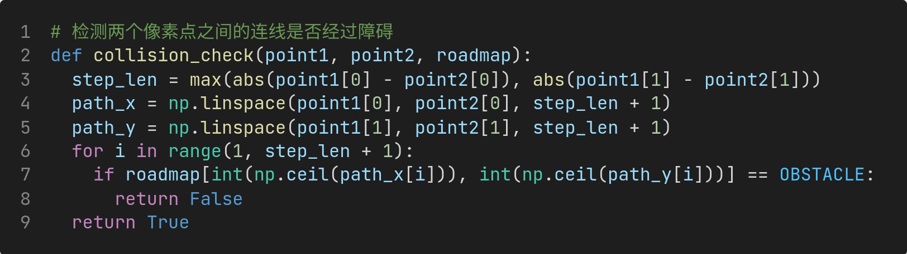
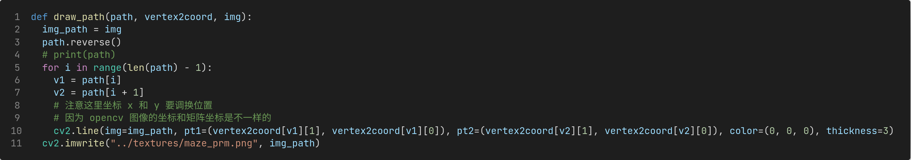

# HW4：PRM 算法路径规划

|                                |                     |
| :----------------------------- | :------------------ |
| 学号：19335109                 | 课程：机器人导论    |
| 姓名：李雪堃                   | 学期：Fall 2021     |
| 专业：计算机科学与技术（超算） | 教师：成慧          |
| 邮箱：i@xkun.me                | TAs：黄家熙、李皖越 |

---

***Table of Contents***

[toc]

---

## (一) 实验要求

- 绿色方块代表起始位置，红色方块代表目标位置，要求在已知地图全局信息的情况下，规划一条尽可能短的轨迹，控制机器人从绿色走到红色。

- 给定了迷宫 webots 模型，地图的全局信息通过读取 `maze.png` 这个图片来获取。

## (二) 实验环境

- Ubuntu 20.04.3 LTS x86_64
- Webots R2021a
- opencv-python 4.5.2.52
- numpy 1.20.2

## (三) 实验过程和核心代码

### (1) 图像和数据处理

提供的地图图像 `maze.png` 是 RGBA 图像，我们首先要对图片进行预处理，用于下一步的采样和建图。图像处理是本次实验中的关键。我使用 opencv 库对图像进行处理。


- 第 1 行，使用 `imread` 函数读取图片。
- 第 3 行，使用 `cvtColor` 函数对图像进行灰度化，采取的是 RGBA 到灰度的转换，因为 PNG 是 4 通道的 RGBA 图像，执行后 `img_gray` 将是单通道的灰度图。这里其实可以手动灰度化，比如简单的取 4 个通道的平均值即可。
- 第 5 ～ 8 行，对灰度图 `img_gray` 进一步二值化，设置阈值为 50，小于 50 的像素值设置为 0（黑色），否则为 255（白色）。也可以用 `threshold` 函数。
- 第 10 ～ 14 行，遍历每个像素点，记录黑色像素的坐标，用于下一步的膨胀操作。注意到记录的坐标是 (j, i)，这是因为 opencv 图像和矩阵每个像素的坐标 x 和 y 是反的。
- 第 16 ～ 17 行，进一步进行膨胀处理，使用 `circle` 函数，以每个黑色像素点的坐标为圆心，画半径为 20 个像素点的实心圆，这样就放大了障碍物的范围。

下面是经过处理后的地图。可以看到，经过二值化，我们去掉了起点和终点的圆圈，防止被错误检测为障碍点。膨胀操作使障碍物变大了很多，但这么做对结果产生了很大影响，使得采样时不会有靠近障碍的点出现，避免搜索出的路径会使小车碰撞到障碍。

|        处理前        |                    处理后                    |
| :------------------: | :------------------------------------------: |
|  |  |

图像处理好后，将其转换为 numpy 数组 `img_mat`。然后遍历 `img_mat`，将黑色像素对应的 `roadmap` 的元素设置为 `OBSTACLE`（`OBSTACLE` 表示该点是障碍，值为 1；`EMPTY` 表示该点无障碍，值为 0）。

`roadmap` 将作为 PRM 算法建图的数据。


### (2) PRM 算法

PRM 算法的思想比较直接，步骤如下：

1. 首先处理图像，获得每个像素坐标到它是否是障碍的映射，这一步我们已经处理完了，`roadmap` 就是需要的数据。

2. 随机生成采样点，检测是否是障碍点（使用 `roadmap` 判断），是则添加到图的顶点列表中。

   - 我在实现时，使用 `vertex2coord` 存储顶点到其坐标的映射，所有的采样点和其对应的坐标存在 `vertex2coord` 中

3. 对图中的每个点，检测两个条件：

   - 两个点之间的曼哈顿距离是否小于 100
   - 两个点之间的连线是否会经过障碍

   如果距离足够小且不会碰撞，则在这两点之间连一条边。（注意到最后的结果可能不是连通图，如果采样个数较少、距离阈值较小的话）

	4. 最后在建好的图上使用搜索算法，搜索一条可行的路径。


下面是计算距离的函数。欧几里德距离只用于碰撞检测，建图时两点之间的距离使用的是曼哈顿距离。


下面是检测两点的直接连线是否会碰到障碍的函数。`step_len` 是路径检查的采样点数，取两点之间路径横向与纵向长度的较大值，保证每个像素都能验证到。`numpy.linspace` 用于生成指定范围内、给定数目的等差数列。使用 `numpy.ceil` 进行取整。



前面说道，图像处理时的膨胀操作很重要。下面是未膨胀和膨胀时，2000 个采样点的对比。

- 明显看到，膨胀过后，采样点不会出现紧靠在墙壁边上的情况。考虑到小车的形状和碰撞体积，这样做保证了规划的路径不会让小车碰撞到墙上。

- 另外，由于提供的图像的问题，仔细观察会发现，左右两边墙壁的缝隙中会出现采样点。这导致最后规划的路径出现 "穿墙" 的情况，膨胀将边缘的缝隙全都填充了，因此不会出现采样点在细小缝隙中的情况。

|          未膨胀过的采样点           |          膨胀过的采样点           |
| :---------------------------------: | :-------------------------------: |
|  |  |

### (3) A* 算法

A* 算法实际上是 Dijkstra 算法的一种改进。最大的区别是，A* 算法使用启发函数 $f$，启发式地进行搜索。
$$
f(n) = g(n) + h(n)
$$
其中 $g$ 代表的是从初始位置沿着已生成的路径到指定待检测格子的移动开销。$h$ 指定待测格子到目标节点的估计移动开销。算法其余迭代的过程实际上与 Dijkstra 算法如出一辙，这里不再赘述（talk is cheap）。

我测试发现，使用曼哈顿距离作为启发函数的代价，比欧几里德距离的效果要更好、更稳定。

`reconstruct_path` 用于回溯构造路径，我们在每次更新路径时，会将当前节点地父节点加入 `path[current]` 中，相当于一个栈，结束后 pop 出来的序列就是搜索到的路径。


下面是根据路径 `path` 在地图上绘制路径的函数。



下面是 PRM 算法搜索出的路径。


## (四) 实验结果

寻线控制器用上次作业的代码，下面是模拟时小车运动的截图。完整录屏请查看 `demo.mp4`。


## (五) 遇到的问题和总结

这次实验中遇到了不少问题：

- 首先是 opencv 中图像的坐标和 numpy 矩阵坐标的问题，opencv 中用 `imread` 读取的图片实际上就是用 `numpy.ndarray` 存储的，但是它们的坐标是相反的（x 和 y 是反的），我被这一点坑了很久。图像处理和画线时出现奇怪的问题，但我在仔细观察后发现了问题所在。

  ```
  0/0---X--->
   |
   |
   Y
   |
   |
   v
   (opencv)
  
  0/0---Y----> 
  |
  |
  |
  X
  |
  |
  v
  (numpy ndarray)
  ```

- 一开始在 PRM 算法中我使用 Dijkstra 算法，路线不稳定、效果很差。因为 Dijkstra 只考虑当前点到起点的距离，而 A* 算法不仅考虑离起点的距离，还考虑了到终点的距离，规划出的路径更加稳定。

  |                   Dijkstra 算法                    |            A* 算法             |
  | :------------------------------------------------: | :----------------------------: |
  |  |  |

- 受到光照和阴影的影响，阴影会被小车摄像头认定为黑线，导致小车偏离轨迹，后来将阈值从 128 下降到 80，就没出现过该问题了。

- 一开始没有做膨胀操作，经常会搜索出贴墙的路线，小车碰撞体积不可忽视，小车还是会碰撞到墙壁上，后来想到对障碍进行膨胀，问题解决。

总之，本次实验的收获很大，虽然困难和问题不少，但只要肯动手、肯探索、肯钻研，就一定能够想到解决办法。程序中除了图像处理用到几个 opencv 的 API，PRM 和 A* 算法都是纯手写的，当看到路径完美、清晰地展现在图片上时，还是非常开心的。

## (六) 参考资料

- https://docs.opencv.org/4.x/d6/d00/tutorial_py_root.html
- https://stackoverflow.com/questions/25642532/opencv-pointx-y-represent-column-row-or-row-column

- https://zhuanlan.zhihu.com/p/65673502

- https://en.wikipedia.org/wiki/A*_search_algorithm
- https://www.cnblogs.com/21207-iHome/p/6048969.html#undefined
