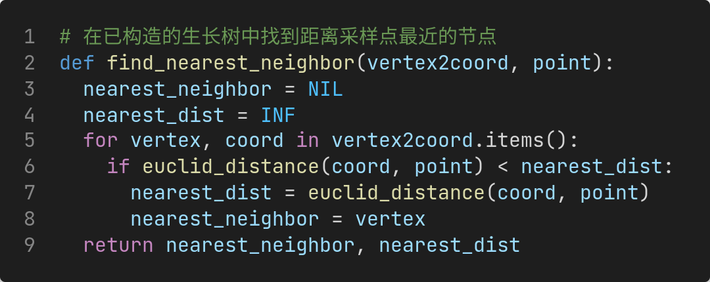
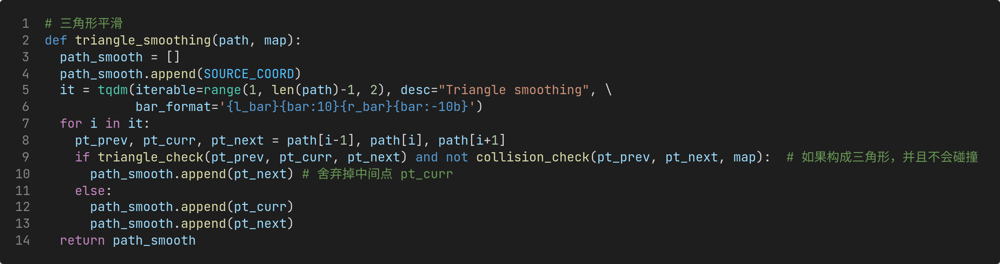

# HW4：RRT 算法路径规划

|                                |                     |
| :----------------------------- | :------------------ |
| 学号：19335109                 | 课程：机器人导论    |
| 姓名：李雪堃                   | 学期：Fall 2021     |
| 专业：计算机科学与技术（超算） | 教师：成慧          |
| 邮箱：i@xkun.me                | TAs：黄家熙、李皖越 |

---

***Table of Contents***

[toc]

---

## (一) 实验要求

- 绿色方块代表起始位置，红色方块代表目标位置，要求在已知地图全局信息的情况下，使用 RRT 算法规划一条尽可能短的轨迹，控制机器人从绿色走到红色。

- 给定了迷宫 webots 模型，地图的全局信息通过读取 `maze.png` 这个图片来获取。

## (二) 实验环境

- Ubuntu 20.04.3 LTS x86_64
- Webots R2021a
- Python
  - opencv-python 4.5.2.52
  - tqdm 4.62.3
  - numpy 1.20.2

## (三) 实验过程和核心代码

### (1) 图像处理

下面是对初始地图进行处理的函数 `img_process`，与上一个作业相同，先进行灰度化、再进行二值化、最后对障碍进行膨胀处理，这里不再赘述。

下面是根据处理后的图像获得每个像素是否是障碍的矩阵，`OBSTACLE` 代表该像素点是障碍，`EMPTY` 代表该点为空。

### (2) RRT 算法

RRT 算法的主要思想和过程：

- 将起点初始化为搜索树 $\mathcal{T}$ 的根节点 $x_{init}$
- 在空间中采样点 $x_{rand}$
- 从搜索树中查找距离采样点 $x_{rand}$ 最近的节点 $x_{near}$
- 沿着 $x_{near}$ 到 $x_{rand}$ 方向前进 $STEP\_SIZE$，得到新节点 $x_{new}$
- 对 $x_{near}$ 和 $x_{new}$ 进行碰撞检测
  - 如果没有碰撞，则完成一次搜索树的扩展，将 $x_{new}$ 加入搜索树中，设置 $x_{new}$ 的父节点为 $x_{near}$
- 重复上面的过程，直到 $x_{new}$ 与 $x_{goal}$ 的距离小于步长 $STEP\_SIZE$，这时认为到达目标位置，搜索结束

RRT 与 PRM 的不同之处在于：

- PRM 首先进行采样，将符合条件的采样点添加到图中，然后在图上进行搜索，搜索出一条可行的路径。
- RRT 使用树来存储点，每次进行采样后，不是直接将该点加入到树中，而是从当前树中寻找离采样点最近的节点，最近的节点向采样点移动一个步长，得到新的节点，把新节点添加到树中。

RRT 这么做加快了路径规划的时间，但仍有缺点：

- 完全随机采样会让 RRT 像无头苍蝇一样混乱地生长，随着节点数的增加，找最近邻居的开销也会越来越大，导致算法时间开销增大、甚至结束后仍然找不到一条可行的路径。

所以，我在实现 RRT 时，将采样 $x_{rand} \leftarrow Sample(\mathcal{M})$ 这一步修改为：
$$
x_{rand} \leftarrow Sample(\mathcal{M}, x_{goal}, EXPLORE\_RATE)
$$
其中，$x_{goal}$ 是目标位置，$EXPLORE\_RATE$ 是一个概率值，称之为探索率。

改进后的 RRT 算法（称为 Goal-Biased RRT），在采样步骤中引入一个探索率，根据探索率来选择树的生长方向是随机生长还是向目标位置生长，即以 $EXPLORE\_RATE$ 的概率选择随机生长，以 $1 - EXPLORE\_RATE$ 的概率选择向目标位置生长。这样可以防止迭代结束后仍然没有搜索到路径，同时加快路径搜索的收敛速度。

Goal-Biased RRT 算法的 Python 实现如下：

在具体实现上，我没有用实际的树结构来存储整个生成树，而是用了两个字典：

- `vertex2coord`：搜索树中每个节点的索引到它坐标的映射（是 `numpy.ndarray` 的坐标，不是 opencv 图像的坐标）
- `parent`：搜索树中每个节点的索引到它父节点索引的映射

注意到，`SOURCE` 和 `DEST` 分别是起始点和终点的索引，预先设置为 0 和 1，所以后面采样点的索引是 `i=2` 开始的。空节点的索引设置为 `NIL`，值为 -1。

这样，在每次生成树扩展时，只要将新节点 $x_{new}$ 的父节点 $x_{near}$ 加入到 `parent` 中即可，最后规划路径时从目标点不断回溯父节点，由 `vertex2coord` 给出路径上每个节点坐标，据此就可以画出整条路径。

另外，每次采样时使用 `numpy.random.binomial(1, EXPLORE_RATE)` 二项分布来确定是探索还是向目标点生长，这里试验次数设置为 1 就相当于伯努利分布。

`find_nearset_neighbor` 的实现如下，比较简单，就是遍历搜索树找距离最小的节点。返回最近节点的索引和距离值。`collision_check` 函数的实现在上次实验有详细叙述，这里不再赘述。

还有一个细节是如何计算 $x_{new}$ 节点。其实只要首先计算出 $x_{near}$ 到 $x_{rand}$ 的方位角 $\theta$，再计算 $x_{new}$ 即可。横坐标为 $x_{near}$ 的横坐标加上步长 $STEP\_SIZE$ 乘以 $\theta$ 的余弦，纵坐标为 $x_{near}$ 的纵坐标加上步长 $STEP\_SIZE$ 乘以 $\theta$ 的正弦。方位角 $\theta$ 的计算使用 `math.atan2` 反正切函数。

下面是 `rrt.py` 运行后生成的结果。运行后，该图片 `rrt_tree.png` 生成在 `rrt` 目录下。观察发现，Goal-Biased RRT 采样点没有覆盖全部的地图，而是越来越趋向于目标点，说明算法的改进还是很有效果的。

### (3) 路径平滑

RRT 搜索到的路径很难用于小车寻线，因为路径中有太多的曲折（小三角形），要生成一个可行的路径基本上要靠碰运气。所以对路径进行处理和平滑操作非常必要。

#### (i) 三角形平滑

下面是对 RRT 生成的原始路径进行三角形平滑的代码（我一拍脑袋写的，尝试后发现效果还不错，我称为三角形平滑）。

算法从初始点出发，每次遍历相邻的三个点 `pt_prev`、`pt_curr`、`pt_next`，即路径方向是 `pt_prev -> pt_curr -> pt_next`，检查这三个点是否会构成三角形，如果构成三角形且 `pt_prev` 到 `pt_next` 不会碰撞，那么就将路径修改为 `pt_prev -> pt_next`，舍弃掉 `pt_curr` 点，这样就消灭了一个折线路径，将它变成了一个直线路径。

这样做其实不太合理，因为三角形不一定就是按你遍历的顺序出现的，但是由于初始 RRT 路径实在太多曲折了，因此还是可以减少不少的折线。而且，三角形平滑还会减少一定数量的节点，减少了后面梯度下降平滑的计算时间。

检测三个点是否构成三角形，用公式 $\displaystyle\frac{1}{2} (x_1 (y_2 - y_3) + x_2 (y_3 - y_1) + x_3 (y_1 - y_2))$ 计算三个点围成的三角形面积，如果面积为 0 说明三点共线，不构成三角形，返回 `False`，否则返回 `True`。

具体实现中用 `path_smooth` 存储平滑后的路径。

#### (ii) 梯度下降平滑

虽然三角形平滑已经消灭了很多路径上的三角形折线，但是仍然存在部分尖锐的三角形，导致小车难以转弯、寻线失败。

可以想到，对于每个小三角形路线，从两个方面考虑平滑后的路径：

- 首先，要求平滑后的路径不能过于偏离所给的路径，即要求平滑后的点 $(\hat{x}_i, \hat{y}_i)$ 与原来的点 $(x_i, y_i)$ 的距离要足够小。
  - 对于坐标来说，就是 $x_i - \hat{x}_i$ 和 $y_i - \hat{y}_i$ 足够小。
- 另外，要求每个三角形折线应足够平滑，那么如何刻画三角形的平滑程度呢？
  - 我们首先考虑极端的情况，对于一个三角形路径 $(p_{i-1}, p_i, p_{i+1})$，最平滑的情况就是中间点 $p_i$ 与起点和终点共线，不妨认为在 $p_{i-1}$ 和 $p_{i+1}$ 的中点，那么就是 $\displaystyle\frac{p_{i-1} + p_{i+1}}{2}$（这样假设是有合理性的，因为不知道 $p_i$ 具体在哪个位置）。
  - 希望平滑后的点足够接近这个中点，就是希望 $p_i$ 与 $\displaystyle\frac{p_{i-1} + p_{i+1}}{2}$ 之间的距离足够小。
  - 对于坐标来说，比如 $x$ 分量，就是 $\displaystyle\frac{\hat{x}_{i-1} + \hat{x}_{i+1}}{2} - \hat{x}_i$ 足够小，不妨乘以 2，即为 $\hat{x}_{i-1} + \hat{x}_{i+1} - 2\hat{x}_i$，对 $y$ 分量同理。

但是，这两个方面实际上是相互冲突的，因为要求不能过于偏离原始路径，那么平滑程度相应地就减弱；要求路径足够平滑，那么就会更加偏离原始路径。

于是，有一个折中的方法，这个方法在数值分析中经常用到，通常被称为松弛操作（还有叫惯性的）。

分别用 $\alpha$ 和 $\beta$ 作为两个方面的参数，以该式对路径的每点进行迭代，迭代次数足够多时，路径就可以足够平滑而且足够接近原始路径。注意要求 $\alpha + \beta = 1$。
$$
\hat{x}_i = \hat{x}_i + \alpha (x_i - \hat{x}_i) + \beta (\hat{x}_{i+1} + \hat{x}_{i-1} - 2 \hat{x}_i) \\
\hat{y}_i = \hat{y}_i + \alpha (y_i - \hat{y}_i) + \beta (\hat{y}_{i+1} + \hat{y}_{i-1} - 2 \hat{y}_i)
$$

- $\alpha$ 可称为保守率，用于刻画平滑后路径偏离原来路径的程度。
- $\beta$ 可称为平滑率，用于刻画路径平滑程度。

下面是梯度下降平滑的代码。平滑的迭代次数为 `SMOOTH_ITER`，是预先设置的。`ALPHA` 和 `BETA` 都设置为 0.5，表示偏离程度和平滑程度相同重要。

下面是 RRT 原始路径、三角形平滑后的路径、以及先进行三角形平滑再梯度下降平滑后的路径的对比。运行 `rrt.py` 后，图片会生成在 `rrt` 目录下，分别是 `raw_path.png`、`triangle_smooth_path.png` 和 `gradient_smooth_path`。

|          未平滑          |              三角形平滑              |       三角形平滑+梯度下降平滑        |
| :----------------------: | :----------------------------------: | :----------------------------------: |
|  |  |  |

可以看到，三角形平滑后，已经消灭了很多微小的三角形，而且路径节点数目减少了。再进行梯度下降平滑后，三角形折线已经全部消失了，取而代之的是平滑的路径，效果非常理想。

### (4) 路径规划

下面是对原始路径处理和规划的函数。

首先从目标点开始不断回溯父节点，获得它们的坐标，得到原始的路径。然后先后对路径进行三角形平滑和梯度下降平滑。最后画出路径的对比、RRT 生成树和最终用于小车寻线的地图。

下面是画出给定路径的函数 `draw_path`，`draw_point` 参数代表是否画出路径上的点，默认为 `False`。

下面是画出 RRT 生成树的函数 `draw_tree`，还会画出规划的原始路径（单纯是用于报告展示）。

### (5) 小车寻线

小车寻线的控制器仍然用前两个作业的代码。即基于图片左右两边黑色像素个数进行转向的方法。前面作业报告中已经详细叙述过，这里不再赘述。

## (四) 实验结果

下面是模拟过程中的截屏。完整的录屏在 `rrt_demo.mp4`，包括整个代码运行、小车寻线的过程。

## (五) 遇到的问题与总结

遇到的问题：

- 在 RRT 中画蛇添足：我开始写 RRT 的时候，没看清算法步骤，采样点只是作为搜索树生长的方向，而不是添加到树中的点，画蛇添足了下面的代码，结果运行特别慢，算法不收敛，后来发现并改正。

- 路径平滑问题：
  - 首先是路径平滑采用的算法，自己尝试减少了三角形后，发现平滑程度还不够，后来查阅资料了解到剃度下降的方法，最后得到的路径非常令人满意，效果也非常好。
  - `cv2.LINE_AA` 是 opencv 画线 `cv2.line` 等函数可选的选项，作用是抗锯齿，画出的线锯齿更少、更平滑。

总之，这次作业实现 RRT 算法难度不高，由于 RRT 算法搜索的路径质量不高、曲折很多、很难直接用于小车寻线，关键在于对路径的平滑处理。

我先后对路径进行三角形平滑减少了大量路径中存在的小三角形、并减少路径中节点的个数，再用梯度下降消减掉剩余的三角形、并对路径做了整体的平滑操作，最后获得了一条非常平滑、有效的路径，使得小车可以轻松地沿着线路运动。我个人对最后的结果非常满意，也非常开心、收获很足。

## (六) 参考资料

- https://zhuanlan.zhihu.com/p/66047152
- https://en.wikipedia.org/wiki/Rapidly-exploring_random_tree
- http://msl.cs.illinois.edu/~lavalle/papers/Lav98c.pdf
- https://vslam.net/2021/03/28/route_planning/%E8%B7%AF%E5%BE%84%E8%A7%84%E5%88%92%EF%BC%88%E5%85%AB%EF%BC%89-RRT%E7%AE%97%E6%B3%95/
- https://dlonng.com/posts/rrt
- https://www.geeksforgeeks.org/check-whether-triangle-is-valid-or-not-if-three-points-are-given/
- https://medium.com/@jaems33/understanding-robot-motion-path-smoothing-5970c8363bc4
- https://blog.csdn.net/qq_29796781/article/details/80113026
