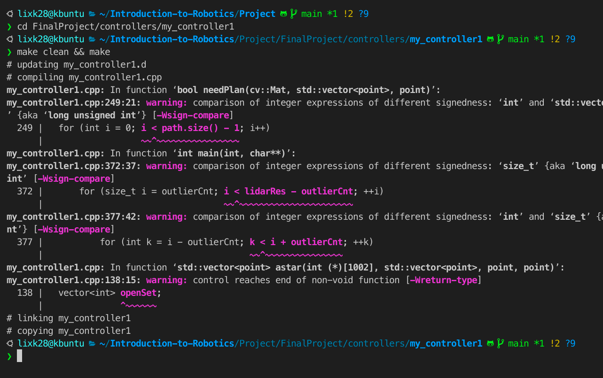

请使用 Ubuntu 20.04 进行测试。

需要先安装 OpenCV 库。

```shell
sudo apt install libopencv-dev
sudo apt install libopencv-core4.2
sudo apt install libopencv-core-dev
```

然后加入 `WEBOTS_HOME` 环境变量。可以加在 `~/.profile` 中，然后 `source ~/.profile`。也可以在一个终端中 export 后再编译控制器（不要重新用另一个终端）。

```shell
export WEBOTS_HOME=/usr/local/webots
```

最后，controller 在 `FinalProject/controllers` 下，`cd` 到某个 controller 的目录下后，`make clean && make` 即可重新编译 controller。

