# 机器人导论期末作业报告

| 学号     | 姓名   |
| -------- | ------ |
| 19335109 | 李雪堃 |
| 19335110 | 李宜谦 |

[toc]

---

## (一) 实验任务

- 实验要求：本次期末作业参考 MotionPlanning.ppt 中 52页的视频设计。需要完成感知、规划、控制算法，在未知环境中控制小车从起点运动到终点。起点为右上角，终点为左下角。

- 实验场景：作业给出了三个场景 world1、world2、world3，其中 1 和 2 为静态场景，3 为动态场景，有两扇可开关的门。

## (二) 实验环境

环境配置请查看 README。

- 操作系统：Ubuntu 20.04.3 LTS x86_64
- 仿真软件：Webots R2021a
- 编译器：gcc 9.3.0
- 构建系统：GNU Make 4.2.1
- 第三方库：OpenCV

## (三) 实验内容与步骤

### (1) 实验思路

实验实现分为感知、规划、控制三部分。其中感知部分使用激光雷达、GPS 和 InertialUnit，规划部分使用 PRM 和 A* 算法，控制部分依据小车的位置和朝向角度控制小车的速度。

### (2) 使用雷达感知障碍物

lidar 参数如下，关键参数是 `fieldOfView`、`maxRange` 和 `type`：

- `fieldOfView`：是雷达视野的弧度，设置为 3.14 则可以获取周围一圈的信息
- `maxRange`：是雷达扫描的最大范围
- `numberOfLayers`：是雷达的层数，我们建的是 2D 图，所以设置为 1，不需要深度信息
- `type`：是雷达的类型，设置为 `rotating` 则雷达每次旋转一周

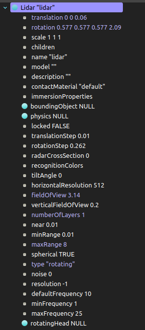

下面是由助教提供的感知部分的关键代码，我们采用的也是这个感知代码。

- 处理运动畸变：每 60 帧一个循环，每当第 4 帧时 (`cnt` 等于 4) ，使用 `getRangeImage` 获得雷达图像，因此在前 3 帧 (`cnt` < 3)，让小车减速

- 判断离群点：若某点与其他点的距离差的平均在阈值外，则认为它是离群点，进行舍弃。

- 计算点云的坐标：首先获取某个点与小车之间的角度 $\alpha = yaw + \pi - \displaystyle\frac{i}{numPts} \times 2\pi$，然后再将小车的坐标加上 `lidarImage[i]` (即小车到点的距离) 乘以该角度的余弦/正弦，得到该点在地图中的坐标

  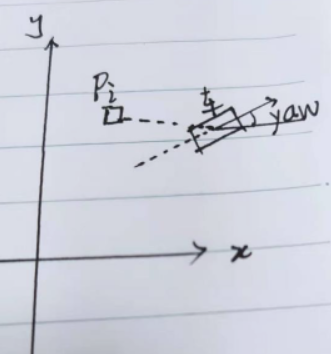

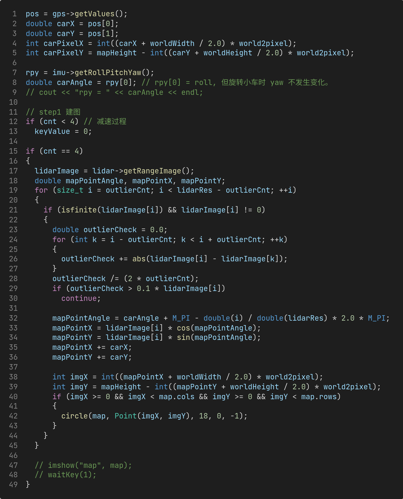

### (3) 使用 PRM + A* 规划路线

两点之间距离采用曼哈顿距离。两点之间碰撞检测的思想是，对两点之间的连线进行采样，判断采样点是否是障碍点，如果是则认为两点之间连线存在障碍。

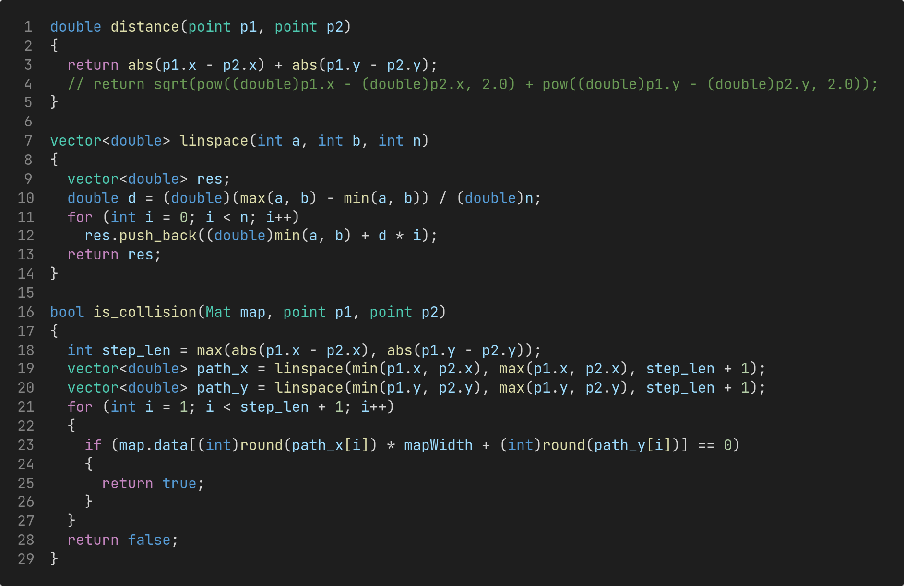

下面是 A* 算法和构建路径的 C++ 代码。

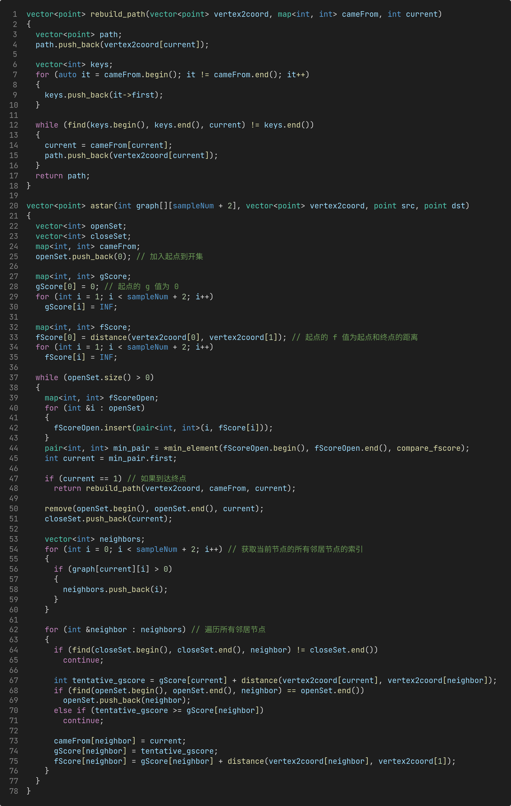

下面是 PRM 算法的 C++ 代码。

`vertex2coord` 是顶点编号到其在 opencv 矩阵中坐标的映射。

图的存储采用一个全局的邻接矩阵 `graph`，`graph[i][j]` 为 0 表示 i 号点和 j 号点之间没有边。

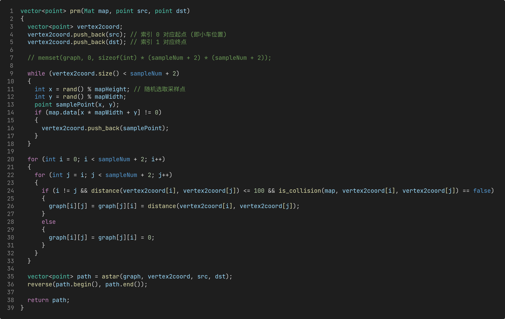

在模拟的每一帧中，判断 `path` 是否为空或者是否需要重新规划。

重新规划的条件是，如果上一次规划的路径上有新检测到的障碍，或者当前小车位置到路径上的下一个点有障碍，那么就进行重新规划。

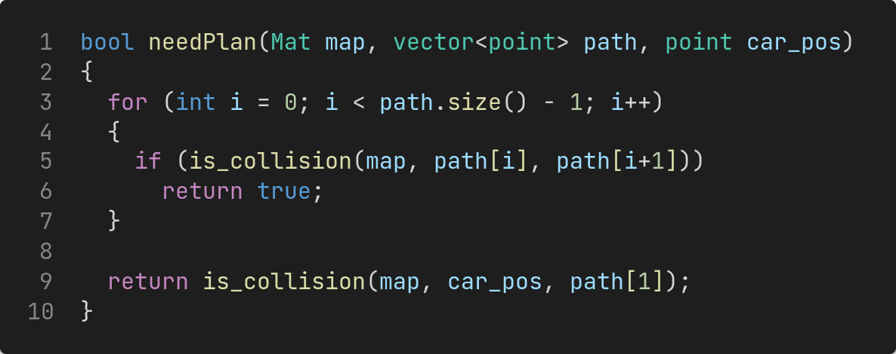

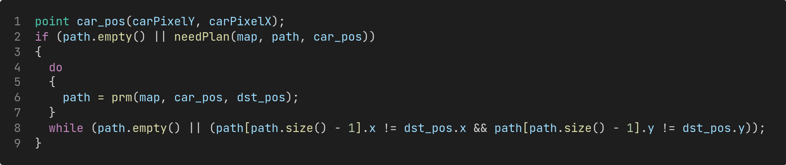

### (4) 控制小车按规划的路线运动

主要逻辑：判断小车的朝向角度Yaw与路线设置的前进的方向对应的角度之差是否在一个较小阈值范围内。若在该范围内，则小车直行，否则小车将进行左转或者右转来调整朝向角度。这里前进的方向通过路径上的点 `path[0]` 到 `path[1]` 的角度来计算。通过函数 `convertDiffToDirection` 计算前进方向。

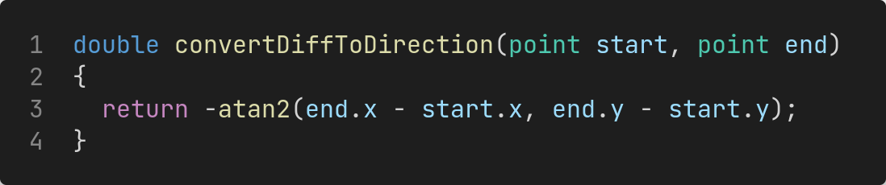

前进方向的计算需要维护路径 `path`。维护 `path[1]` 为下一个目标点，设置当小车与 `path[1]` 的距离小于一定值时，认为到达目标点，将 `path[0]` 从路径中删除。

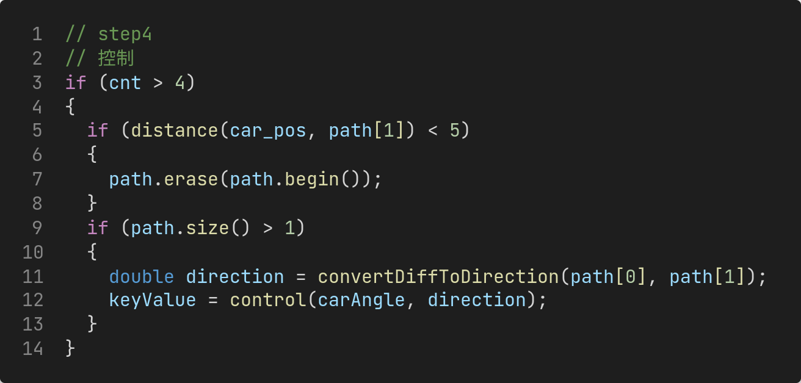

当小车朝向角度 `currentYaw` 与路径方向 `pathDirection` 之差不在阈值内时，小车进行转向。当路径方向在小车中轴线的左侧时，小车左转，否则路径方向在小车中轴线的右侧，小车右转。

具体判断逻辑如下：当 `currentYaw < 0` 时，小车运动的反方向为 `currentYaw + M_PI` ，若 `pathDirection` 在 `(currentYaw, currentYaw + M_PI)` 之间，说明路径方向在小车中轴线的左侧，小车左转；否则小车右转。

当 `currentYaw >= 0` 时，小车运动的反方向为 `currentYaw - M_PI`，若 `pathDirection在(currentYaw, M_PI)` 之间或者 `(-M_PI, currentYaw – M_PI)` 之间时，说明路径方向在小车中轴线的左侧，小车左转；否则小车右转。

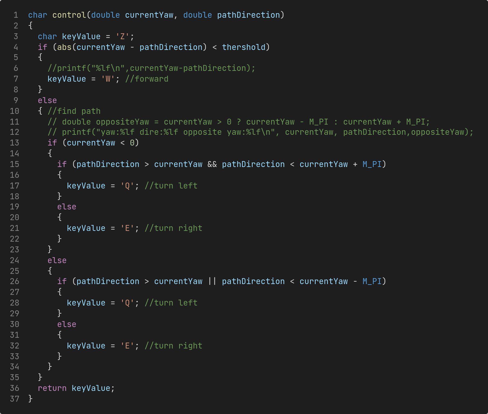

当小车到达终点 `dst_pos` 时，将速度设置为0。

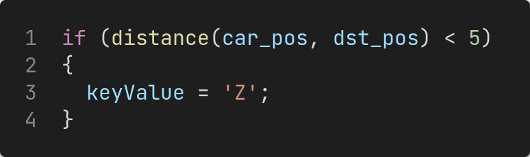

## (三) 实验结果与分析

我们的控制器代码在大部分测试中可以让小车跑到终点，但是有时候小车顶到墙上时，控制器会 crash。我们认为是代码中存在数组越界的问题，但是 debug 了很久也没有很好地解决。另一种可能是，每 60 帧的第 4 帧才会获取雷达点云，有可能后面控制小车运动的过程中，小车撞到了墙，这之间存在一定的延迟。还有可能是 A* 算法死循环了，有的时候雷达扫描的图像会在莫名其妙的地方出现黑色障碍，而这些地方原本不是障碍物，导致切断了到终点之间的可行路径，A* 算法死循环。

world1 和 world2 可以顺利跑到终点，world3 有时候不能跑到终点（当小车在门周围时控制器容易 crash）。

demo 请查看 `world1_demo.mp4`、`world2_demo.mp4` 和 `world3_demo.mp4`。